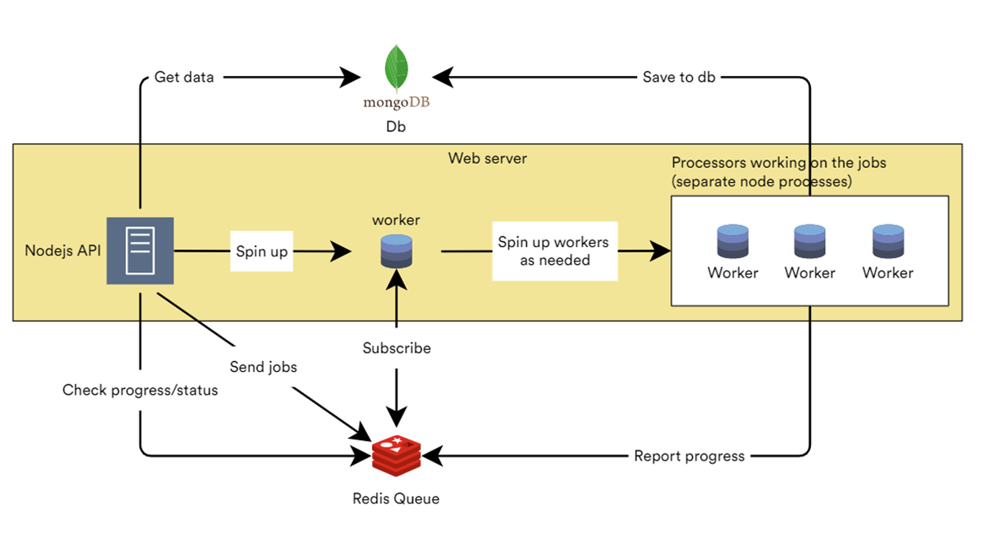

# Course Grade system

A prototype for a grade system used to upload course grades and allow students to view their grades using their id, it used worker queues to handle large data efficiently

## Diagram

## Technology 

- Nodejs
- Redis
- MongoDb
- Docker

## Build a dev environment using docker

Run 
```
docker compose -f .\docker-compose.dev.yml up
```

if you made any changes to the project it will reload automatically,
the project is shared with the docker instance

## Build a dev environment manually

- Install nodejs
- Install redis 
- Install MongoDb

RUN
```
node index.js
```

## Running tests
Before running tests make sure that redis and mongoDb are running

Run
```
npm test
```

## Swagger docs
```
http://localhost:3000
```

